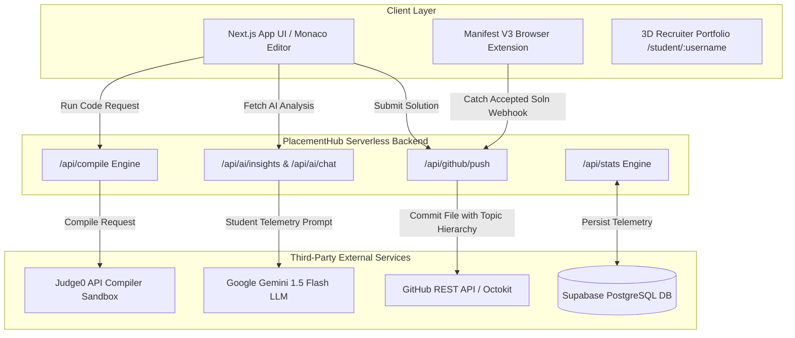
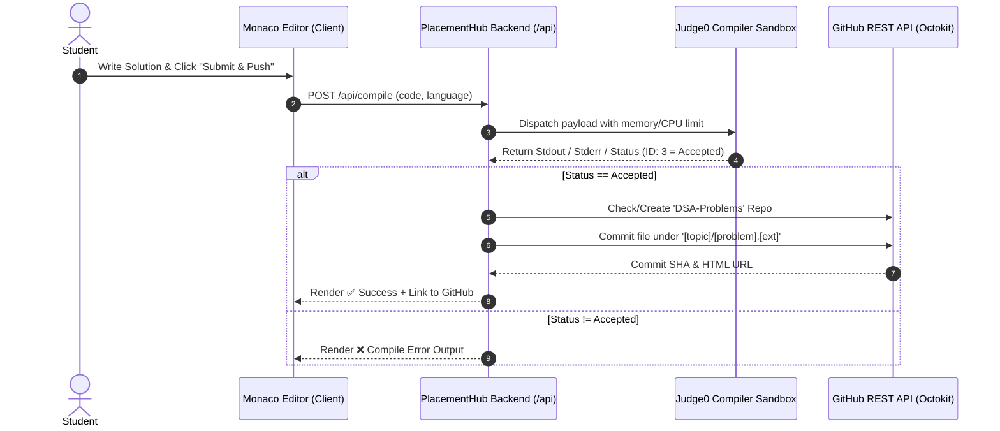
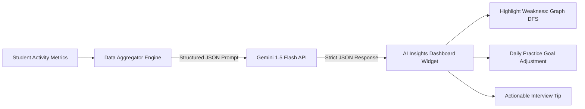
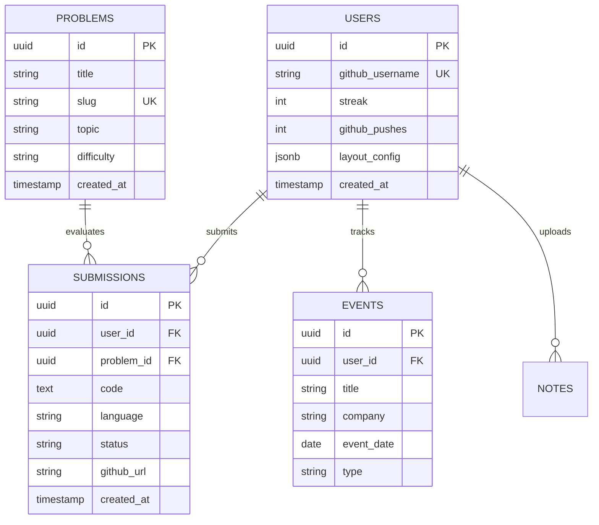

# PlacementHub 🚀 — System Design & Architecture Document

<p align="center">
  
  
  
  
  
</p>

> **PlacementHub** is an end-to-end, autonomous engineering preparation platform designed for Computer Science students. It unifies in-app sandboxed code execution, AI performance coaching via Gemini, seamless automated GitHub synchronization, university resources, placement assessment arenas, and interactive 3D portfolio generation into a unified ecosystem.

---

## 📐 System Architecture Overview

PlacementHub follows a modular, decoupled micro-architecture combining a Next.js 14 App Server, serverless API execution pipes, third-party sandboxed compilers, generative AI models, webhooks, and a standalone client extension.



---

## 🛠 Core Module Subsystems

### 1. The Autonomous Code Workspace (Compilers & GitHub Sync)
- **Integrated Text Engine**: Built on the **Monaco Editor** (`@monaco-editor/react`), supporting C++, Java, Python, JavaScript, and SQL syntax rules.
- **Sandboxed Compilation Pipe**: Code payloads are dispatched to `/api/compile` which interfaces with the **Judge0 CE API** over HTTP headers. Submissions run in an isolated environment with memory (128MB) and CPU timeout constraints.
- **Instant GitHub Push Engine**: Upon achieving an `Accepted` execution status, `/api/github/push` communicates via Octokit REST API to:
  1. Verify or dynamically create a public `DSA-Problems` repository on the user's GitHub profile.
  2. Format code headers with metadata (problem name, execution date, topic).
  3. Commit the file under topic-based directory structures (e.g. `Anubhab/DSA-Problems/Linked-Lists/reversal.cpp`).



---

### 2. Cross-Platform Auto-Sync Engine (Browser Extension)
- **Manifest V3 Service Worker**: Runs silently in the background (`/extension`).
- **Telemetry Scraper**: Intercepts DOM mutations and network execution packets on platforms like LeetCode and Codeforces.
- **Silent Webhook Dispatcher**: Upon detecting an `Accepted` DOM badge, `content.js` extracts the code snippet and transmits a webhook payload to PlacementHub (`http://localhost:3001/api/github/push`), syncing external platform progress to GitHub automatically.

---

### 3. Dynamic Adaptive User Dashboards & Gen AI Analyst
- **Modular Fluid Interface**: Glassmorphism aesthetic using CSS Custom Properties and dark theme tokens (`#000000` base, `#7c3aed` neon violet, `#00d4ff` electric cyan).
- **Gemini Performance Analyst**: Aggregates problem accuracy across tags (DP, Graphs, Trees), compilation error metrics, and streak counts, piping strict JSON schema prompts to **Gemini 1.5 Flash**. Returns dynamic weakness box alerts, strong area highlights, and adjusted daily practice goals.



---

### 4. Live Recruiter Portfolio & 3D Project Showcase
- **Theme Builder Architecture**: Instant layout recalculations via CSS Custom Property tokens (`Cyberpunk Neon`, `Minimal Stark`, `Corporate Clean`).
- **3D Interactive Project Deck**: Built in `app/student/[username]/page.tsx` using 3D transformation matrices. Listens to cursor pointer coordinates to rotate project architecture cards along $X$ and $Y$ axis in real time.

---

## 🗄 Database & Persistence Schema (Supabase / PostgreSQL)



---

## 🛠 Tech Stack

| Domain | Technology |
|---|---|
| **Framework** | Next.js 14 (App Router, Server Actions) |
| **Frontend UI** | Vanilla CSS Modules, CSS Custom Properties, Glassmorphism |
| **Code Editor** | Monaco Editor (`@monaco-editor/react`) |
| **Code Compiler** | Judge0 CE API Sandbox |
| **AI Engine** | Google Gemini API (`@google/generative-ai`) |
| **GitHub Automation** | GitHub REST API via `@octokit/rest` |
| **Database & Auth** | Supabase (PostgreSQL + Auth) |
| **Cognitive Engine** | `chess.js` (Web Worker AI logic) |
| **Browser Extension** | Chrome Manifest V3 (Background Workers & Content Scripts) |

---

## 🚀 Local Setup & Installation

### 1. Clone & Install Dependencies
```bash
git clone https://github.com/anubhab-cloud/PlacementHub.git
cd PlacementHub
npm install --legacy-peer-deps
```

### 2. Configure Environment Variables
Create a `.env.local` file in the root directory:
```env
# Code Compilation (Judge0 via RapidAPI)
JUDGE0_API_KEY=your_rapidapi_key
JUDGE0_API_HOST=judge0-ce.p.rapidapi.com

# Gemini AI Key
GEMINI_API_KEY=your_gemini_api_key

# GitHub Automation Token
GITHUB_TOKEN=ghp_your_personal_access_token
GITHUB_USERNAME=your_github_username

# Supabase Storage
NEXT_PUBLIC_SUPABASE_URL=https://your-project.supabase.co
NEXT_PUBLIC_SUPABASE_ANON_KEY=your_supabase_anon_key
```

### 3. Run Development Server
```bash
npm run dev
```
Open [http://localhost:3001](http://localhost:3001) in your browser.

---

## 📜 License

Distributed under the MIT License. Built for Computer Science students preparing for placements.
